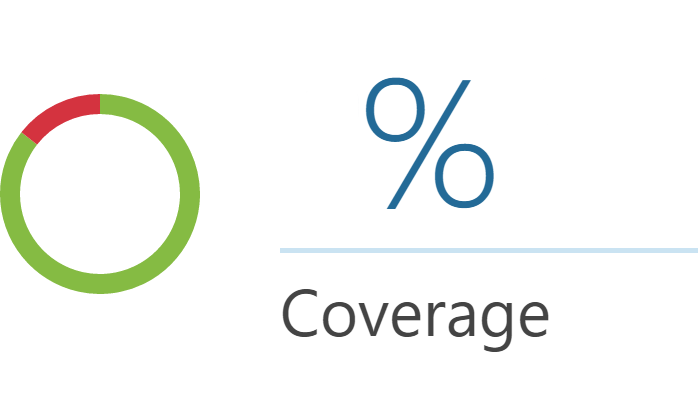
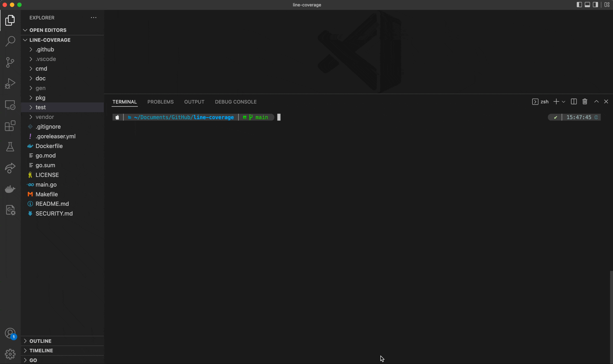

<div id="top"></div>
<!--
*** Thanks for checking out the Best-README-Template. If you have a suggestion
*** that would make this better, please fork the repo and create a pull request
*** or simply open an issue with the tag "enhancement".
*** Don't forget to give the project a star!
*** Thanks again! Now go create something AMAZING! :D
-->

<!-- PROJECT SHIELDS -->
<!--
*** I'm using markdown "reference style" links for readability.
*** Reference links are enclosed in brackets [ ] instead of parentheses ( ).
*** See the bottom of this document for the declaration of the reference variables
*** for contributors-url, forks-url, etc. This is an optional, concise syntax you may use.
*** https://www.markdownguide.org/basic-syntax/#reference-style-links
-->

[![Contributors][contributors-shield]][contributors-url]
[![Forks][forks-shield]][forks-url]
[![Stargazers][stars-shield]][stars-url]
[![Issues][issues-shield]][issues-url]
[![MIT License][license-shield]][license-url]
[![LinkedIn][linkedin-shield]][linkedin-url]

<!-- PROJECT LOGO -->
<br />
<div align="center">
  <a href="https://github.com/Liu-Chunhui/line-coverage">
    
  </a>

<h3 align="center">line-coverage</h3>
  <p align="center">
    Scans and calculates code line-coverage for Golang projects
    <br />
    <a href="/doc"><strong>Explore the docs »</strong></a>
    <br />
    <br />
    <a href="https://github.com/Liu-Chunhui/line-coverage/issues">Report Bug</a>
    ·
    <a href="https://github.com/Liu-Chunhui/line-coverage/issues">Request Feature</a>
  </p>
</div>

<!-- TABLE OF CONTENTS -->
<details>
  <summary>Table of Contents</summary>
  <ol>
    <li>
      <a href="#about-the-project">About The Project</a>
      <ul>
        <li><a href="#built-with">Built With</a></li>
      </ul>
    </li>
    <li>
      <a href="#getting-started">Getting Started</a>
      <ul>
        <li><a href="#installation">Installation</a></li>
      </ul>
    </li>
    <li><a href="#usage">Usage</a></li>
    <li><a href="#roadmap">Roadmap</a></li>
    <li><a href="#contributing">Contributing</a></li>
    <li><a href="#license">License</a></li>
    <li><a href="#contact">Contact</a></li>
  </ol>
</details>

<!-- ABOUT THE PROJECT -->

## About The Project

<div align="center">
  <a href="https://github.com/Liu-Chunhui/line-coverage">
    
  </a>
</div>

### Built With

- [Go](https://go.dev/)
- [Docker](https://www.docker.com/)

<!-- GETTING STARTED -->

## Getting Started

To get a local copy up and running follow these simple example steps.

### Installation

- Download binary

  - [Release page](https://github.com/Liu-Chunhui/line-coverage/releases)

- Install binary

  ```
  go install github.com/Liu-Chunhui/line-coverage

  ```

<!-- USAGE EXAMPLES -->

## Usage

### Binary

1. `coverage` file is required for calculating line coverage. For example, when execute `make test` on [line-coverage](https://github.com/Liu-Chunhui/line-coverage), `./gen/coverage.out` as the coverage file will be generated
1. `go.mod` with path need to be provided
1. then execute `$ line-coverage -c ./gen/coverage.out -m go.mod`

### Docker

// TODO

<p align="right">(<a href="#top">back to top</a>)</p>

<!-- ROADMAP -->

## Roadmap

See the [open issues](https://github.com/Liu-Chunhui/line-coverage/issues) for a full list of proposed features (and known issues).

<p align="right">(<a href="#top">back to top</a>)</p>

<!-- CONTRIBUTING -->

## Contributing

Contributions are what make the open source community such an amazing place to learn, inspire, and create. Any contributions you make are **greatly appreciated**.

If you have a suggestion that would make this better, please fork the repo and create a pull request. You can also simply open an issue with the tag "enhancement".
Don't forget to give the project a star! Thanks again!

1. Fork the Project
2. Create your Feature Branch (`git checkout -b feature/AmazingFeature`)
3. Commit your Changes (`git commit -m 'Add some AmazingFeature'`)
4. Push to the Branch (`git push origin feature/AmazingFeature`)
5. Open a Pull Request

<p align="right">(<a href="#top">back to top</a>)</p>

<!-- LICENSE -->

## License

Distributed under the MIT License. See [LICENSE](/LICENSE) for more information.

<p align="right">(<a href="#top">back to top</a>)</p>

<!-- CONTACT -->

## Contact

Project Link: [https://github.com/Liu-Chunhui/line-coverage](https://github.com/Liu-Chunhui/line-coverage)

<p align="right">(<a href="#top">back to top</a>)</p>

<!-- MARKDOWN LINKS & IMAGES -->
<!-- https://www.markdownguide.org/basic-syntax/#reference-style-links -->

[contributors-shield]: https://img.shields.io/github/contributors/Liu-Chunhui/line-coverage.svg?style=for-the-badge
[contributors-url]: https://github.com/Liu-Chunhui/line-coverage/graphs/contributors
[demo]: doc/demo/demo.gif
[forks-shield]: https://img.shields.io/github/forks/Liu-Chunhui/line-coverage.svg?style=for-the-badge
[forks-url]: https://github.com/Liu-Chunhui/line-coverage/network/members
[stars-shield]: https://img.shields.io/github/stars/Liu-Chunhui/line-coverage.svg?style=for-the-badge
[stars-url]: https://github.com/Liu-Chunhui/line-coverage/stargazers
[issues-shield]: https://img.shields.io/github/issues/Liu-Chunhui/line-coverage.svg?style=for-the-badge
[issues-url]: https://github.com/Liu-Chunhui/line-coverage/issues
[license-shield]: https://img.shields.io/github/license/Liu-Chunhui/line-coverage.svg?style=for-the-badge
[license-url]: https://github.com/Liu-Chunhui/line-coverage/blob/master/LICENSE.txt
[linkedin-shield]: https://img.shields.io/badge/-LinkedIn-black.svg?style=for-the-badge&logo=linkedin&colorB=555
[linkedin-url]: https://linkedin.com/in/chunhui-liu-400a7652
